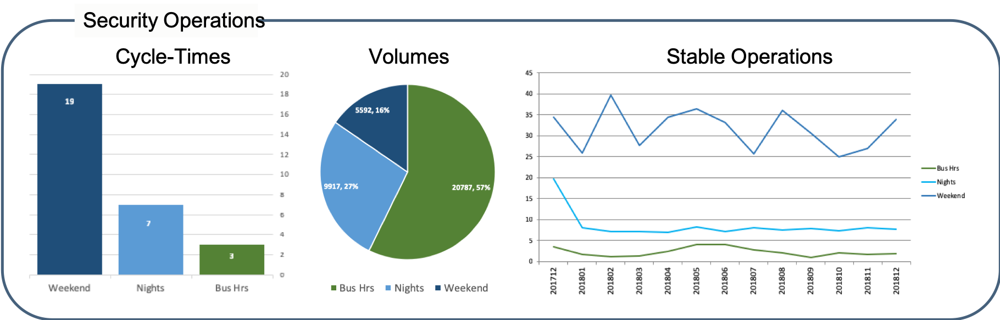
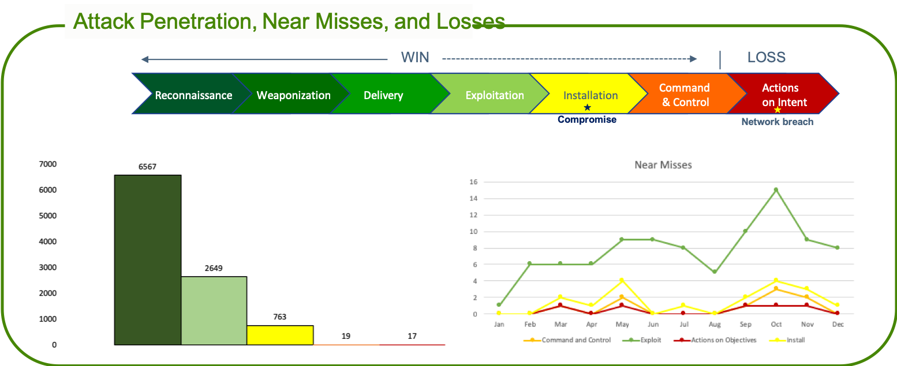
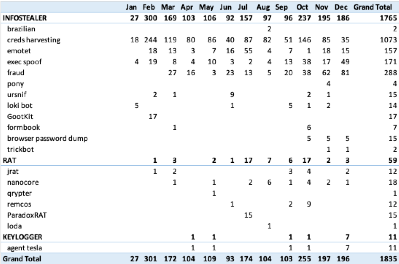
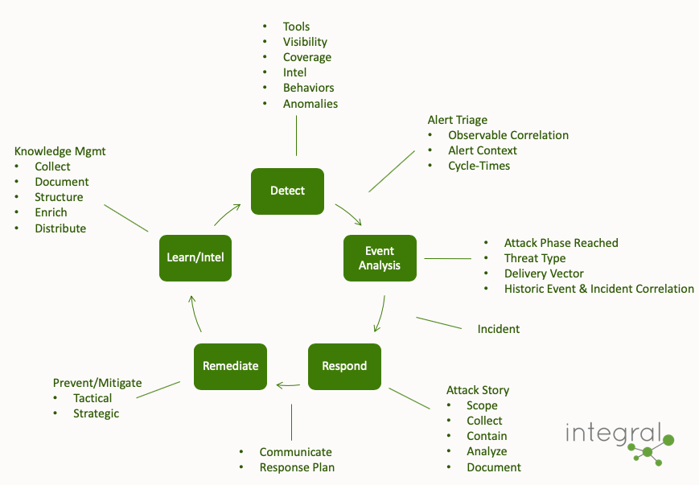
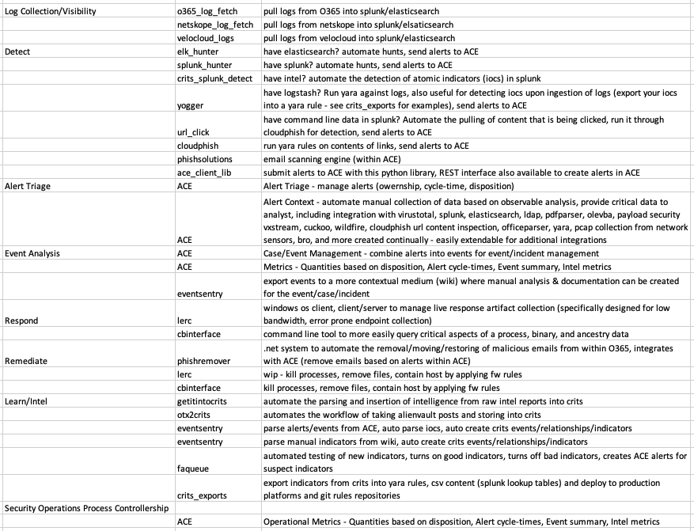
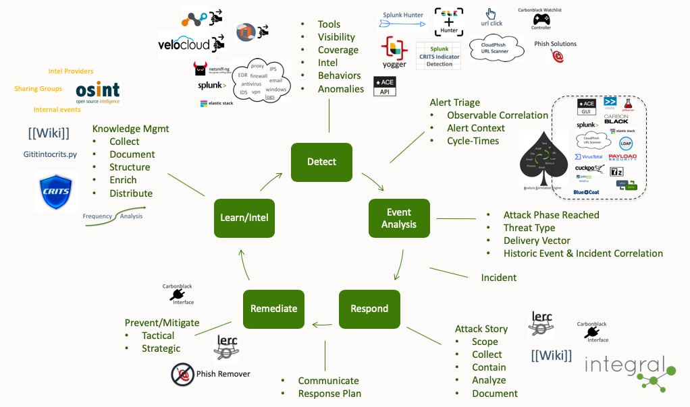

### I love not doing things, and I love that by not doing things we can do more things ###
 
- I love that we no longer need to manually pull pcaps for an IDS alert, it's just part of the alert in ACE. No more worries about pcaps rolling off before manually grabbing them. No more command line craziness to find and extract the pcaps related to the alert. No more scp'ing pcaps all over the place before we can analyze them.
- I love not having to manually lookup who a user is, where they are located, or what employee a computer belongs to, it's just part of the alert.
- I love that we no longer need to manually submit files to our sandboxes or manually lookup results on VT, it's just part of the alert.
- I love, upon a customized phish detection that bypasses our email preventions, we don't have to login to exchange, find the email and remove it. I love that we don't have to put in a ticket for removal. I love that ACE has a button to remediate it.
- I love how easily & quickly we detect credential harvester phish, remediate them, and know if any of our employees visited or supplied credentials.
- I love that we no longer need to manually combine and keep track of important alerts that relate to an attack, I can just combine them into ACE events.
- I love that as we have gotten better at detecting and remediating phish, the number of attacks that reach installation has almost vanished. (Actually, if I'm honest, I wish we had installation events more often to maintain our response skills.)
- I love, appreciate, and take for granted so many of the things we have created to improve our program.
 
Things that use to be hard, or tedious, no longer are. This provides us the opportunity to work on the next hard thing.
 
Why not have ACE do things, so your team can do more things?
 
Let's join forces and ***automate the ordinary!***
 
***(Ok and maybe the extraordinary too)***

_________________________________________________________________________________________________

### Table of Contents
**[Are You Winning?](#are-you-winning)** 
**[Custom Phish Detection For The Win](#custom-phish-detection-for-the-win)** 
**[Move to a Free First strategy](#move-to-free-first)** 
**[Opensource is well positioned for security automation](#opensource-is-well-positioned-for-security-automation)** 
**[The Process](#the-process)** 
**[Hello](#hello)** 

### Are You Winning?

What does winning look like in cybersecurity? 
	
	- No business operations disruption? 
	- No financial loss? 
	- No loss of important data? 
	- No brand negativity? 

If you are winning, how well are you winning? 

What if you measured every attack that gets around at least one of your preventions? What if, for every one of these attacks you measured how far the attack made it in the attack cycle?
 
Dispositioning your security alerts by attack cycle provides this insight.

ACE not only provides you the ability to automate the ordinary, it also collects the data you need to understand your threats and risk, as part of the normal security operations process. 

##### Do you understand your security operations? #####

##### Can you show you are winning? #####

##### Do you know what threats are getting past your defenses? How well do you detect and prevent these threats? #####

________________________________________________________________________________________________

### Custom Phish Detection For The Win
#### Catch phish, clean'em, and use'em as bait ####

Ok, so phishing is not new, but waves of relentless phishing continue and bypass email prevention systems daily. It is odd that year over year the number of phishing attacks getting past prevention systems continues to increase.

From Business Email Compromise, to credential harvesters, to malicious attachments, and links to all sorts of malicious files; phishing is still the easiest, lowest cost delivery vector for attackers. Good thing for us it is also the easiest to detect (__believe it!__). 

In my experience if you have a good phishing prevention system and a good phishing awareness program, you are still missing attacks…a lot of attacks. While prevention is the ultimate goal, there is so much additional value gained by detecting and learning from the phish that bypass your preventions! 

   - **The best Intel source.** Those indicator feeds are nice, but way less valuable than the intel you gain when analyzing the phishing attacks that get past your preventions. This is the source of the most relevant, high quality, kill chain diverse intel you can find. Instead of investing in intel feeds, maybe you should invest in detection. 
   - **Practice.** Learning is all about iteration. Being able to iterate the detect, respond, intel cycle often and quickly will train your team intrinsically. They will better understand their data, visibility, and how it all fits together. They will then be prepared to work more stressful incidents, understand what is high priority vs what can wait, and more quickly focus on the right items. 
   - **Credibility.** When you get to the point of calling an employee minutes after they click a link to provide real-time training, the word gets around, and the company knows your team can be trusted. This drives the ability to influence and increases your chance of budget to improve on gaps.
   - **Winning.** Stop the attack early in the attack cycle instead of the resource intensive work of cleaning things up when the attacks reach further into the attack cycle. Know about the attack early in the cycle and feed that information into your detection systems quickly, so you are warned if later stages of the attack cycle are reached.
   - **Metrics & Risk identification.** Having data to show how far attacks are getting before they are prevented, the cycle times involved with alert triage, and the data to show what types of attacks you are facing all lead to an understanding of risk. Having this data builds credibility and trust, which helps when you need money to fill gaps and grow your program.
   - **Ease of disposition.** Alerts for email, if done correctly, have the most context of any type of alert and are amongst the easiest to triage. Very quick to disposition and respond to. 
   - **Combat Alert Fatigue.** When you are detecting attacks, learning from them, tuning detection, and remediating them quickly, alert fatigue issues are dramatically reduced. Alert fatigue is more of an issue when only false positives are witnessed, or the same non-value, long cycle-time, zero context alert comes in. Not the case with email alerts done correctly.
	
**"Give a Man a Phish, and You Feed Him for a Day. Teach a Man To Phish, and You Feed Him for a Lifetime."**

The barrier to entry is low. This is what you get for free. We hope you join us to build on the existing capabilities.

   - **Out of band and extremely easy to implement.** This means you can be bleeding edge with your detection, no worries of causing email disruption, the business continues as usual. Let your prevention systems do the preventions.
   - **Log rich email metadata.** JSON log format includes all aspects of the email, including attachment details, links found within the email, and all header metadata. Easily ingest into your log aggregation system.
   - **Recursive file analysis.** Supports common delivery vector file types (like doc, pdf, archive formats), easily exteded.
   - **Metrics.** Track cycle-time, events, and incidents out of the box. By dispositioning alerts based on attack phase you automatically have data on the stage of the attack reached.
   - **Custom yara rules for detection!**
   - **Alert management.** The alert, with all the analysis completed, presented to an analyst for easy disposition.
   - **Email Remediation Integration.** Integrate click button remediation of emails with O365 (PhishRemediation project).
   - **Dynamic file analysis integration.** Integrates with Cuckoo, VXStream, and Wildfire sandboxes.
   - **Link inspection integration.** Automatically analyze content of links with ACE's cloudphish (free) configuration.
   - **Integrates** with Integral's **Event Sentry** and **CRITS** for event processing and intel collection/distribution automation.
   - **Integrates with standard ACE** analysis/correlation modules which means you can **automate the ordinary**.

________________________________________________________________________________________________

### Move to Free First
#### Moving to a "Free First" approach for cybersecurity ####
Step 1: call salesperson, Step 2: get quotes, Step 3: compare functionality.

Remember the days when the strategy was to look for a commercial tool first? That strategy has led to quite a few purchases, some that we are now stuck with, some that we still get value from.

But, as I look at the opensource security system landscape, I'm thinking we need to move to a "Free First" mindset. Getting involved with opensource, seeing projects grow into extremely capable systems, and seeing how quickly they are becoming mainstream…why not take a little time to research opensource before you buy? What's the downside? For good opensource projects the time investment is relatively small. Setup a proof of concept to understand the functionality and learn how it fits into your security program (without the marketing FUD). Worst case, you become more educated and better prepared for determining the value of the commerical tools.

Maybe you are looking to buy automation tools. Maybe you are thinking about a SIEM.  

Maybe you should go "Free First".

________________________________________________________________________________________________

### Opensource is well positioned for security automation ###
Some interesting quotes about SOAR related to the opportunities, limitations for integrations, unrealized out-of-the-box value, and adoption predictions [here](https://blogs.gartner.com/anton-chuvakin/2018/02/22/our-security-orchestration-and-automation-soar-paper-publishes/)

SOAR is all about connecting systems into a cohesive process. Who is in the position to accomplish this the best? Every company has different systems they use and rely on. Who is best positioned to create the integrations & systems necessary to connect them?

I believe the teams that rely on those technologies and use them every day to accomplish a mission are in the best position to continually improve & maintain those technologies. Unfortunately, I don't believe a commercial solution is best suited to provide this. How many integrations can a commercial solution actually support, test, and maintain as systems change? How do they prioritize the integrations? How quickly can one company do this? Does it align with your needs? In my experience, this is a bottleneck to success. Conversely, this is the value of opensource; connecting not only disparate systems, but teams, your specific priorities, and processes into a cohesive solution.

We have a great foundation that supports a mature process. We've learned from and implemented systems based on both our every day experience, as well as collaboration with best in class companies. Take security collaboration to a new, meaningful level. Join us!

#opensourceftw #collaboration #improvecybersecurity #forthemasses #worktogether #flexible #ownyourprocess

________________________________________________________________________________________________

### The Process
#### The Why, and how it fits together ####
Our goal is not the creation of code, it is the streamlining of this process. With that said, to enable the capability & effectiveness of this process we have created and integrated systems. Creating smart systems to improve this process has been our key to success. 

All of the tools required to accomplish this process are now available from Integral Defense for free. Join us!

The short and skinny...

Additional details...

Where the tools fit into the process...

________________________________________________________________________________________________

## Hello
#### integral systems for cyber defense ####

There are many good security tools across the computing landscape, from email, network, and endpoint, to log aggregation, machine learning, case management, vulnerability management, and many more. Connecting these systems together in an efficient and meaningful way is still a major challenge within a security ecosystem. This github site contains a variety of code, including productivity tools, integration scripts, sophisticated detection capabilities, alert management, and an analysis correlation engine (**ACE**).

Every company is different. The combination of technology stacks, attack surfaces, and threat actors are not consistent across companies. Much of the code within this repo can be easily enhanced to accommodate specific technologies and allow you to make strides towards lean, efficient processes for your security program...not to mention the killer out of the open-box capabilities!

Your friends, 
***Integral Defense***

_Code long and prosper_ 
_Take a penny, leave a penny_ 
_"For a bunch of hairless apes, we've actually managed to invent some pretty incredible things"_ 
_"I know that the future is scary at times. But there's just no escaping it"_
